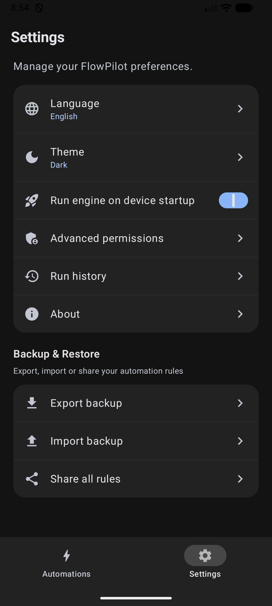

<div align="center">

# ⚡ FlowPilot

### The private, battery-first Android automation engine — without root.

Automate your device seamlessly with event-driven triggers, privileged system actions via Shizuku, and a fluid Material 3 interface. No telemetry, no cloud accounts, and zero background battery drain.

<br/>

[](https://github.com/emi-ran/flowpilot/releases)
[-34A853?logo=android&logoColor=white)](https://developer.android.com)
[](https://kotlinlang.org)
[](https://developer.android.com/jetpack/compose)
[](https://shizuku.rikka.app)
[](#-privacy--zero-trust-promise)
[](LICENSE)

<br/>

[**🇺🇸 English**](README.md) &nbsp;•&nbsp; [**🇹🇷 Türkçe**](README.tr.md)

<br/>

<p align="center">
  <a href="https://github.com/emi-ran/flowpilot/releases/latest">
    
  </a>
  &nbsp;
  <a href="#-how-flowpilot-works">
    
  </a>
  &nbsp;
  <a href="#-ready-to-use-presets">
    
  </a>
  &nbsp;
  <a href="#-shizuku-setup-guide">
    
  </a>
</p>

</div>

---

> [!NOTE]
> **📱 Device Compatibility & Community Testing Notice**
> FlowPilot is an independent open-source project, actively developed and primary-tested on **Xiaomi HyperOS (Xiaomi 15T Pro)**. Strict adherence to standard Android Jetpack and system APIs is maintained throughout the codebase, and CI verifies runtime contracts against an **API 35 Android Emulator**.
>
> Because OEM skins (Samsung One UI, Google Pixel, Motorola, OxygenOS, etc.) implement background process limits differently, your test reports, feedback, and pull requests are warmly welcomed!

---

## 🌟 Why FlowPilot?

Most Android automation tools force you to choose between steep complexity, heavy battery drain, or intrusive cloud logins. **FlowPilot was built to fix this.**

<table>
  <tr>
    <td width="50%">
      <h3>🔋 Battery-First &amp; Event-Driven</h3>
      <p>No constant CPU wake-locks or polling loops. Hardware sensors (accelerometer, proximity, light) and broadcast receivers register <b>only when an active rule needs them</b> and unregister instantly when idle.</p>
    </td>
    <td width="50%">
      <h3>🔒 100% Offline &amp; Private</h3>
      <p>No analytics, no telemetry, no remote servers, and no accounts. Everything happens on your device. Webhooks and SMS actions send only the data you explicitly configure.</p>
    </td>
  </tr>
  <tr>
    <td width="50%">
      <h3>🛡️ Rootless System Superpowers</h3>
      <p>Harness the power of <b>Shizuku</b> to toggle Mobile Data, Airplane Mode, GPS, Dark Mode, and Force Stop apps using elevated ADB permissions—without rooting or voiding warranties.</p>
    </td>
    <td width="50%">
      <h3>🎨 Modern Material 3 &amp; Compose</h3>
      <p>Crafted completely in native <b>Jetpack Compose</b>. Experience fluid 60/120 FPS transitions, dynamic Material You theming, haptic feedback, and glanceable Home Screen widgets.</p>
    </td>
  </tr>
  <tr>
    <td width="50%">
      <h3>🔊 Offline Text-to-Speech (TTS)</h3>
      <p>Let your phone talk to you with on-device synthesized voice caching. Create custom spoken alerts for battery events, bedtime reminders, or location changes—zero internet required.</p>
    </td>
    <td width="50%">
      <h3>🔐 Safe Sharing &amp; Encrypted Backups</h3>
      <p>Export portable sanitized JSON rules to share with friends, or secure your entire library with <b>AES-256-GCM password encryption</b> (PBKDF2 with 100,000 iterations).</p>
    </td>
  </tr>
</table>

---

## 📸 Screenshots

<div align="center">
  <table>
    <tr>
      <td align="center" width="20%"><b>Home Screen</b></td>
      <td align="center" width="20%"><b>Ready Presets</b></td>
      <td align="center" width="20%"><b>Rule Builder</b></td>
      <td align="center" width="20%"><b>Settings &amp; Backup</b></td>
      <td align="center" width="20%"><b>About Dialog</b></td>
    </tr>
    <tr>
      <td></td>
      <td></td>
      <td></td>
      <td></td>
      <td></td>
    </tr>
  </table>
</div>

---

## 💡 How FlowPilot Works

FlowPilot follows a clear, intuitive 3-step mental model:

```
┌───────────────────────────┐      ┌───────────────────────────┐      ┌───────────────────────────┐
│       1. TRIGGER          │      │       2. CONDITIONS       │      │        3. ACTIONS         │
│     "When this happens"   │ ───► │    "Only if all match"    │ ───► │    "Do this in order"     │
│   (e.g., Arrive at Work)  │      │     (e.g., Weekdays Only) │      │  (Silent + Turn on Wi-Fi) │
└───────────────────────────┘      └───────────────────────────┘      └───────────────────────────┘
```

### Relatable Examples:
- 🌙 **Bedtime Routine:** *When* the clock strikes 23:30 ➔ *Only if* charging ➔ *Turn on* Silent Mode, enable Dark Theme, and dim brightness to 10%.
- 🔋 **Full Charge Alert:** *When* battery reaches 100% ➔ *Speak* "Phone is fully charged, please unplug" and show notification.
- 🔕 **Flip to Silence:** *When* phone is placed face-down on a desk ➔ *Immediately* enable Do Not Disturb with a subtle confirmation pulse.

---

## ⚡ 1-Tap Ready Presets

Start automating instantly with built-in recipes designed for everyday life:

| Preset | Trigger | Key Actions |
| :--- | :--- | :--- |
| 🌙 **Bedtime Routine** | Time reaches 23:30 | Enables Dark Mode, sets Silent profile, turns on DND, dims screen to 10% |
| 🔋 **Full Battery Protection** | Battery reaches 100% | Speaks offline unplug voice reminder & pushes persistent notification |
| ⚡ **Battery Saver Emergency** | Battery drops below 15% | Turns on Battery Saver, disables Bluetooth, lowers brightness, enables Dark Mode |
| 🔕 **Flip to Silence** | Phone placed face-down | Dual sensor check (Proximity + Gravity Z-axis) enables DND with a haptic pulse |
| 🔦 **Shake for Flashlight** | Firm phone shake | Toggles rear camera torch with tactile haptic feedback |
| 🎬 **Cinema / Night Reading** | Ambient light drops < 5 lx | Dims brightness to minimum and switches system to Dark Theme |
| 🚗 **Leaving Home Mode** | Disconnected from Home Wi-Fi | Enables Mobile Data (Shizuku), sets Normal ringer, raises volume to 80% |
| 🏠 **Welcome Home Mode** | Connected to Home Wi-Fi | Disables Mobile Data (Shizuku) to save power and restores balanced settings |
| 📍 **SMS Emergency Responder** | Incoming SMS with secret phrase | Locks GPS coordinates and replies with a live Google Maps location link |

---

## 🎛️ Feature Matrix

### 1. Triggers (Events)
FlowPilot listens to a rich spectrum of hardware, radio, and system events:

- 📱 **App Lifecycle:** App launched or closed (lightweight `UsageStatsManager` transitions).
- 🔌 **Power & Battery:** Charger plugged in / unplugged, battery level rises above or drops below custom percentage.
- 💡 **Screen & State:** Screen turned on/off, device unlocked.
- ⏰ **Schedule & Time:** Daily, weekdays, weekends, or specific days and exact times.
- 📶 **Connectivity:** Wi-Fi connected/disconnected (any or target SSID), Bluetooth device connected/disconnected.
- 🔄 **Sensors & Motion:**
  - **Device Flip:** Face-down on table or turned face-up (Proximity + Gravity Z-axis with 500ms debounce).
  - **Shake:** Firm shake detection with configurable sensitivity slider.
  - **Ambient Light:** Lux drops below or rises above target threshold.
- 📍 **Hardware Geofencing:** Enter or exit defined geographical zones using Google Play Services `GeofencingClient`. Zero idle battery drain, up to 50 persistent queued events across engine restarts, and coordinate reuse for template variables.
- 🏷️ **NFC Tags:** Instant hex UID matching on physical scans. Foreground ReaderMode scans run matching rules automatically; background Android discovery opens FlowPilot and requires explicit confirmation before any matching NFC automation runs.
- 📞 **Phone & SMS:** Call ringing, answered, outgoing dialed, call ended; SMS received with keyword, prefix, regex, or exact sender matching.
- 🔔 **Notifications:** Incoming notifications from selected apps with keyword filtering.

---

### 2. Conditions (Logic Gates)
Rules execute only when all specified conditions (AND logic) are satisfied:

- ⏳ **Time Window:** Run only between specific hours (e.g., 23:00 to 07:00), with full midnight-crossing support.
- 📅 **Days of the Week:** Restrict to weekdays, weekends, or custom individual days.
- 🔋 **Battery Level:** Require battery to be $\ge$ or $\le$ a specific threshold.
- ⚡ **Charging State:** Require device to be currently charging or discharging.
- 📲 **Screen State:** Require screen to be on or off.
- 📶 **Wi-Fi Network:** Require connection to a specific Wi-Fi network (SSID).

---

### 3. Actions (Executors)
Chain multiple actions in any custom sequence with drag-and-drop ordering and individual delays (0–300s):

- 🌐 **Connectivity (via Shizuku):** Toggle Wi-Fi, Mobile Data, Airplane Mode, Bluetooth, and GPS Location.
- 🖥️ **Display & Device:** Toggle Flashlight (Torch), Dark Theme (Shizuku), Auto-rotate, Brightness level, Lock Screen (Shizuku), and Force Stop App (Shizuku).
- 🔊 **Sound & Alerts:** Do Not Disturb (DND) toggle, Sound Profiles (Normal / Vibrate / Silent), Media Volume (0–100%), Custom Audio playback (1–60s duration), Haptic Patterns (Pulse, Double Tap, Alert, Heartbeat, Triple Tap, SOS), and Rich Notifications.
- 🗣️ **Offline Speech (TTS):** Speak custom voice alerts using Android's on-device TTS engine with speech rate control.
- ⏱️ **Clock & Timers:** Set system alarm or start a background timer (1s–24h).
- 🚀 **Apps & Web:** Launch installed app or open web URL.
- 💬 **Phone & SMS:** Open dialer, place direct phone call, send automated background SMS, or prepare SMS draft.
- 🔗 **HTTPS Webhook:** Send outbound HTTP requests (`GET`, `POST`, `PUT`, `PATCH`, `DELETE`, `HEAD`) with custom headers, JSON body, AES-256-GCM Keystore encrypted secrets, and dynamic template variables:
  - `${trigger}`, `${batteryPercent}`, `${isCharging}`, `${wifiSsid}`, `${time}`, `${timestamp}`, `${location.lat}`, `${location.lng}`, `${location.coords}`, `${location.maps_url}`

---

### 4. Smart Productivity & Controls
- **Quick Settings Tile & Engine Notification:** Toggle the automation engine or inspect live status directly from Android's notification shade. Engine status and startup-failure notifications follow FlowPilot's English, Turkish, or system-language setting even after a background restart.
- **Material 3 Home Screen Widget:** Glance-powered widget displaying active rule counts with a one-tap pause/resume button.
- **In-App Live Test Run:** Test any rule action directly inside the editor before saving to verify parameters.
- **Safe Rule Duplication:** Clone any rule into an immediately editable disabled copy with freshly encrypted webhook credentials.
- **Execution Run History:** Local persistent audit trail of the last 100 executions with masked sensitive details. Raw provider errors, private URIs, local paths, credentials, and phone numbers are not persisted.
- **Conflict Warnings:** Automatic non-blocking analysis warning you when opposite state actions target the same trigger.

---

## 🛡️ Shizuku Setup Guide

FlowPilot uses **Shizuku** to perform elevated actions (Mobile Data, Airplane Mode, GPS, Dark Mode, App Killing) safely without needing root.

1. **Install Shizuku:** Get it from [Google Play](https://play.google.com/store/apps/details?id=moe.shizuku.privileged.api) or [GitHub](https://shizuku.rikka.app/).
2. **Start Shizuku Service:**
   - **On Android 11+ (Wireless Debugging):** Start directly on your phone using Developer Options > Wireless Debugging (no PC required).
   - **Via PC (ADB):** Run the following command:
     ```bash
     adb shell sh /sdcard/Android/data/moe.shizuku.privileged.api/start.sh
     ```
3. **Authorize FlowPilot:** Open FlowPilot and tap **Grant** when prompted for Shizuku access.
4. All elevated actions will now be unlocked and execute instantly!

---

## 🔒 Privacy & Zero-Trust Promise

FlowPilot is engineered with an uncompromised commitment to user privacy:

- 🚫 **Zero Telemetry:** No Firebase Analytics, no Sentry, no remote crash reporters, and zero tracking SDKs.
- 📵 **No Cloud Synchronization:** Your automations, logs, and secrets never touch any third-party cloud.
- 🛡️ **Hardware Keystore Protection:** Webhook secrets, tokens, and sensitive headers are encrypted with AES-256-GCM using hardware-backed Android Keystore keys.
- 🙈 **Strict Log Sanitization:** Phone numbers, webhook credentials, and sensitive headers are masked across all UI screens and audit logs.

### Transparent Permission Disclosures
FlowPilot declares sensitive permissions solely to power explicit automation features:
- `QUERY_ALL_PACKAGES`: Required to list installed apps in the App Trigger and App Launcher pickers on Android 11+.
- `RECEIVE_SMS` & `SEND_SMS`: Used exclusively by the SMS trigger and direct SMS responder actions.
- `ACCESS_BACKGROUND_LOCATION`: Powers zero-battery hardware geofencing (`GeofencingClient`) and injects coordinates only into user-configured automations.
- `FOREGROUND_SERVICE_LOCATION`: Required by Android 14+ to keep geofencing and active location tasks compliant while running in the background.

*Note: FlowPilot does not seek Google Play approval because these uncompromised permissions are essential for core automation functionality. Download verified APKs directly from GitHub Releases.*

---

## 📦 Backup & Recovery

| Mode | Format | Security | Ideal For |
| :--- | :--- | :--- | :--- |
| **Sanitized JSON** | Plain JSON | Webhook URLs & credentials stripped | Sharing automation rules with friends or online communities |
| **Encrypted Backup** | Encrypted Container | **AES-256-GCM + PBKDF2** (100k iterations, salt + IV) | Full backup including secrets, phone numbers, and enabled states |

Restoring is effortless: choose your file, enter your password, and select **Merge** or **Replace**. Secrets are automatically re-encrypted with your new device's local Android Keystore.

---

## 🛠️ Tech Stack & Architecture

FlowPilot follows modern Android architecture guidelines:

```
FlowPilot
├── app/src/main/java/com/flowpilot/app/
│   ├── actions/          # Executors: Shizuku, Audio, TTS, Webhook, SMS, System
│   ├── analysis/         # AutomationConflictAnalyzer and logic checks
│   ├── data/             # Models, JSON Serialization, DataStore Repositories, Backups
│   ├── engine/           # Foreground AutomationService, Receivers, Sensor Trackers
│   ├── glance/           # Jetpack Glance Home Screen Widget
│   ├── quicksettings/    # System Quick Settings Tile Service
│   ├── shizuku/          # Shizuku AIDL IPC client bridge
│   └── ui/               # Jetpack Compose UI (Material 3 Theme, Screens, Components)
└── app/src/test/         # Deterministic JUnit unit test suites
```

- **Language:** Kotlin 2.2.10
- **UI Toolkit:** Jetpack Compose & Material 3
- **Async Runtime:** Kotlin Coroutines & StateFlow
- **Storage:** Jetpack DataStore (Preferences & JSON)
- **Encryption:** Android Keystore (AES-256-GCM)
- **Privileged Bridge:** Shizuku AIDL IPC
- **Widgets:** Jetpack Glance
- **Target SDK:** Android 16 (API 36) &bull; **Min SDK:** Android 8.0 (API 26)

---

## 📥 Build from Source

### Prerequisites
- JDK 17 (OpenJDK or Eclipse Temurin)
- Android SDK (Platform 36, Build-Tools 36.0.0+)
- Git

```bash
# Clone the repository
git clone https://github.com/emi-ran/flowpilot.git
cd flowpilot

# Run unit tests
./gradlew testDebugUnitTest

# Assemble debug APK
./gradlew assembleDebug
```

Compiled APK output:
```text
app/build/outputs/apk/debug/app-debug.apk
```

Install directly to your connected device:
```bash
adb install -r app/build/outputs/apk/debug/app-debug.apk
```

---

## 🤝 Contributing

Contributions, bug reports, and ideas are welcome!
- Check out [CONTRIBUTING.md](CONTRIBUTING.md) to get started.
- Found a bug? Open a [Bug Report](https://github.com/emi-ran/flowpilot/issues/new?template=bug_report.md).
- Want to propose a new trigger or action? Submit a [Feature Request](https://github.com/emi-ran/flowpilot/issues/new?template=feature_request.md).

---

## 📄 License

FlowPilot is free and open-source software licensed under the **[GNU General Public License v3.0 (GPL-3.0)](LICENSE)**.

<div align="center">
  <br/>
  <b>Made with ❤️ for Android Power Users</b>
</div>
