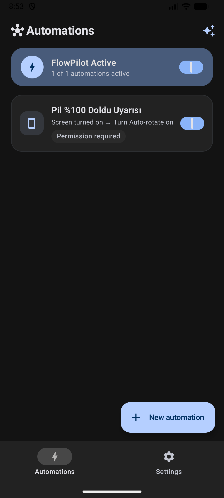
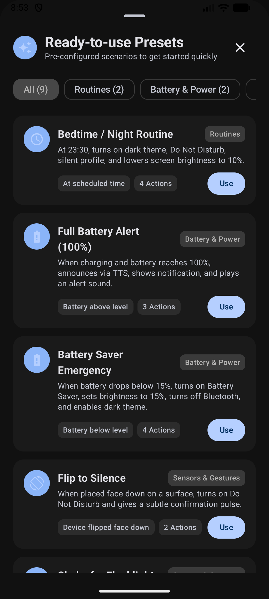
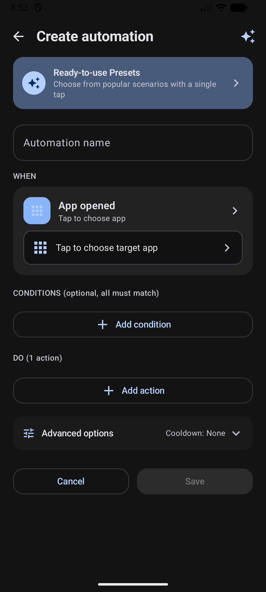
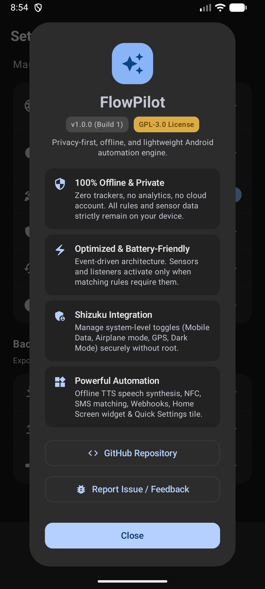

<div align="center">

# ⚡ FlowPilot

**Privacy-first, offline, and lightweight Android automation engine.**

[](LICENSE)
[-brightgreen.svg)](https://developer.android.com)
[](https://kotlinlang.org)
[](https://developer.android.com/jetpack/compose)
[](https://shizuku.rikka.app)
[](https://mi.com)
[](#build--installation)

<br/>

[🇺🇸 English](README.md) &nbsp;•&nbsp; [🇹🇷 Türkçe](README.tr.md)

</div>

---

> [!NOTE]
> **📱 Device Compatibility & Community Testing Notice:**  
> FlowPilot is created by an independent developer and is currently **developed and tested primarily on Xiaomi HyperOS (Xiaomi 15T Pro)**, as this is the developer's primary personal device. Standard Android APIs and best practices are adhered to wherever possible, but compatibility with other OEM skins (Google Pixel, Samsung One UI, OxygenOS, Motorola, etc.) has **not been tested yet**. Feedback, test reports on other hardware, and pull requests from other developers are warmly welcomed!

## 🌟 Why FlowPilot?

Most popular automation tools on Android are burdened with cloud requirements, account registrations, intrusive telemetry, battery-draining continuous polling, or complex legacy interfaces.

**FlowPilot** takes a completely different approach:

- 🔒 **Private by Default:** No telemetry or cloud sync. Configured Webhooks, SMS, and exports can send only data you choose.
- ⚡ **Battery-Efficient & Event-Driven:** No constant CPU wake-locks. Sensors (accelerometer, proximity, ambient light) and broadcast receivers register only on-demand when active rules require them.
- 🛡️ **Shizuku Integration:** Execute system-level tasks (toggle Mobile Data, Airplane Mode, GPS, Dark Mode) securely with user-granted ADB permissions—without requiring root access.
- 🎨 **Modern Material 3 Design:** Fully native Jetpack Compose architecture supporting dynamic Dark & Light themes, fluid animations, and high accessibility standards.
- 🔊 **Offline Text-to-Speech (TTS):** Pre-synthesized on-device voice audio caching with zero cloud dependency.
- 🔄 **Open Ecosystem:** Export, import, and share automation rules in plain JSON format with Merge and Replace strategies.

---

## 📸 Screenshots

<div align="center">
  <table>
    <tr>
      <td align="center" width="25%"><b>Home Screen</b></td>
      <td align="center" width="25%"><b>Ready Presets</b></td>
      <td align="center" width="25%"><b>Create Automation</b></td>
      <td align="center" width="25%"><b>Settings &amp; About</b></td>
    </tr>
    <tr>
      <td></td>
      <td></td>
      <td></td>
      <td></td>
    </tr>
  </table>
</div>

---

## 🚀 Key Features

### 1. Triggers (Events)
FlowPilot responds to a wide spectrum of hardware, system, and user events:
- **Application:** App opened or closed (via low-overhead `UsageStatsManager` transitions).
- **Power & Battery:** Charger plugged in / unplugged, battery drops below or rises above custom threshold percentage.
- **Display & State:** Screen turned on / off, device unlocked.
- **Time & Scheduling:** Daily, weekdays, weekends, or specific custom days and times.
- **Connectivity & Radios:** Wi-Fi connected or disconnected (any or specific SSID), Bluetooth device connected or disconnected (bonded devices).
- **Sensors & Motion:**
  - **Device Flip:** Phone placed face down on a surface or turned face up (dual physical validation: Proximity sensor + Gravity/Accelerometer Z-axis with 500ms debounce).
  - **Shake:** Firm shake detection with configurable sensitivity.
  - **Ambient Light:** Darker than or brighter than lux target with real-time sensor sampling.
- **Hardware & Tags:** NFC tag scanned (hex UID matching).
- **Communications:**
  - **Incoming/Outgoing Calls:** Ringing, answered, outgoing placed, and call ended states.
  - **SMS Messages:** Filtered by sender number and matching modes (contains keyword, exact match, prefix, or regex).
- **Notifications:** Notifications received from selected installed apps with optional keyword filter.

---

### 2. Conditions (Logic Gates)
Rules execute only when all specified conditions (AND semantics) are satisfied:
- **Time Window (`TIME_BETWEEN`):** e.g., only run between 23:00 and 07:00, with full overnight midnight-crossing support.
- **Days of the Week (`DAYS_OF_WEEK`):** Filter by weekdays, weekends, or custom day toggles.
- **Battery Level:** Only if battery is $\ge$ or $\le$ threshold.
- **Charger State:** Only while charging or discharging.
- **Screen State:** Only while screen is on or screen is off.
- **Wi-Fi State:** Only while connected to a specific Wi-Fi SSID.

---

### 3. Actions (Executors)
Chain multiple sequential actions within a single rule, complete with custom drag-and-drop reordering and individual delay timers (0–300s):
- **Connectivity (via Shizuku):** Toggle Wi-Fi, Mobile Data, Airplane Mode, Bluetooth, and Location.
- **Display & Tools:** Toggle Flashlight (Torch), Dark Theme (Shizuku), Auto-rotate, Screen Brightness, Lock Screen (Shizuku), and Force Stop App (Shizuku).
- **Sound & Alerts:** Do Not Disturb (DND) ON/OFF, Sound Profiles (Normal / Vibrate / Silent), Set Media Volume (0–100%), Play Tone/Custom Audio (1–60s duration), Vibrate (Pulse, Double Tap, Alert, Heartbeat, Triple Tap, SOS), and Show Notification.
- **Speech Synthesis (TTS):** Speak custom voice message using Android offline TTS engine with rate control and on-device cache.
- **Clock & Alarms:** Create system alarm, start background timer (1s–24h with `EXTRA_SKIP_UI`).
- **Apps & Web:** Launch installed application, open website URL.
- **Phone & SMS:** Open dialer, dial phone number, directly place phone call, send direct automated background SMS, prepare SMS draft.
- **HTTPS Webhook:** Send outbound HTTPS requests (`GET`, `POST`, `PUT`, `PATCH`, `DELETE`, `HEAD`) with headers, body, AES-256-GCM Keystore encrypted secrets, and live template variables (`${trigger}`, `${batteryPercent}`, `${isCharging}`, `${wifiSsid}`, `${time}`, `${timestamp}`, `${location.lat}`, `${location.lng}`, `${location.coords}`, `${location.maps_url}`).

---

### 4. Ready-to-Use Presets (Recipes)
FlowPilot includes pre-built one-tap templates to get started quickly:
- 🌙 **Bedtime Routine:** At 23:30, enables Dark Mode, sets sound profile to Silent, turns on DND, and dims brightness to 10%.
- 🔋 **Full Battery Protection (100%):** Announces unplug reminder via offline TTS and shows notification when battery finishes charging.
- ⚡ **Battery Saver Emergency:** At 15% battery, turns on Battery Saver, disables Bluetooth, sets brightness to 15%, and enables Dark Mode.
- 🔕 **Flip to Silence:** Turning phone face down activates Do Not Disturb with a confirmation pulse.
- 🔦 **Shake for Flashlight:** Firm shake toggles the camera torch with haptic feedback.
- 🎬 **Cinema / Night Reading:** Low ambient light (<5 lx) dims brightness and enables dark theme.
- 🚗 **Leaving Home Mode:** Disconnecting from home Wi-Fi activates mobile data, sets normal ringer, and raises media volume to 80%.
- 🏠 **Welcome Home Mode:** Connecting to home Wi-Fi disables mobile data and restores balanced settings.
- 📍 **SMS Emergency Location Responder:** When incoming SMS matches secret keyword, acquires active GPS coordinates and replies with live Google Maps link.

---

### 5. Quick Controls & Widgets
- **Quick Settings Tile:** Toggle the automation engine or view live status directly from Android notification shade.
- **Home Screen Widget (Jetpack Glance):** Modern widget displaying active rule counts with one-tap pause/resume button.
- **In-App Manual Test Run:** Test rule actions directly while editing with real parameters without needing to save first.
- **Execution Run History:** Local persistent audit log of the last 100 executions with detailed per-action results (strictly sanitized of credentials and phone numbers).

---

## 🛠️ Architecture & Tech Stack

```
FlowPilot
├── app/src/main/java/com/flowpilot/app/
│   ├── actions/          # Action executors (Shizuku, TTS, Webhook, Audio, System, Phone)
│   ├── data/             # Models, JSON Serialization, DataStore Repository, Backup/Restore
│   ├── engine/           # Foreground AutomationService, BroadcastReceivers, Sensor Trackers
│   ├── glance/           # Jetpack Glance Home Screen Widget implementation
│   ├── quicksettings/    # System Quick Settings Tile Service
│   ├── shizuku/          # Shizuku AIDL IPC client bridge
│   └── ui/               # Jetpack Compose UI (Theme, Screens, Components, Pickers)
└── app/src/test/         # Deterministic JUnit unit test suites
```

- **Language:** Kotlin 2.0+
- **UI Framework:** Jetpack Compose & Material 3
- **Concurrency:** Kotlin Coroutines & StateFlow
- **Persistence:** Android Jetpack DataStore (Preferences & JSON serialization)
- **Security:** Android Keystore (AES-256-GCM encrypted webhook credentials at rest)
- **System Control:** Shizuku AIDL IPC Bridge
- **Widgets:** Android Jetpack Glance (Compose-style App Widgets)
- **Compatibility:** Min SDK 26 (Android 8.0 Oreo) — Target / Compile SDK 36 (Android 16)

---

## 📥 Build & Installation

### Prerequisites
- JDK 17 (Eclipse Temurin or OpenJDK)
- Android SDK with Platform 36 and Build-Tools 36.0.0+
- Git

### Build from Source
```bash
# Clone the repository
git clone https://github.com/emi-ran/flowpilot.git
cd flowpilot

# Run unit tests
./gradlew testDebugUnitTest

# Assemble debug APK
./gradlew assembleDebug
```

The compiled APK will be located at:
```text
app/build/outputs/apk/debug/app-debug.apk
```

### Install to Device via ADB
```bash
adb install -r app/build/outputs/apk/debug/app-debug.apk
```

---

## 🛡️ Shizuku Integration Guide

Certain privileged actions (toggling Mobile Data, Airplane Mode, GPS, Dark Mode, or Force Stopping apps) require **Shizuku** to run elevated commands without root access.

1. Install [Shizuku](https://shizuku.rikka.app/) from Google Play or GitHub.
2. Start Shizuku via **Wireless Debugging** (Android 11+) or via ADB from a computer:
   ```bash
   adb shell sh /sdcard/Android/data/moe.shizuku.privileged.api/start.sh
   ```
3. Open **FlowPilot** -> When prompted, grant Shizuku permission to FlowPilot.
4. All Shizuku-gated actions will now show as **Available** and execute seamlessly.

---

## 🔒 Privacy & Permissions Notice

FlowPilot operates on a **zero-trust privacy model**:
- **No Telemetry or Cloud Sync:** The app contains no crash reporters, analytics endpoints, remote ad SDKs, or cloud synchronization.
- **Configured Data Sharing:** User-configured Webhooks, SMS actions, and exports can send only data you choose.
- **Location:** Used strictly locally to read current Wi-Fi SSID and optionally inject coordinates into user-defined Webhooks or SMS replies.
- **Phone & SMS:** Used only to trigger automations on call states or user-specified SMS text patterns. Phone numbers are masked in all logs and history.

### Distribution and restricted permissions

FlowPilot declares `QUERY_ALL_PACKAGES` because its user-facing App Picker enumerates installed launchable apps for app triggers and app-targeted actions. It declares `RECEIVE_SMS` for incoming SMS triggers and `SEND_SMS` for user-configured direct SMS actions. It declares `ACCESS_BACKGROUND_LOCATION` and `FOREGROUND_SERVICE_LOCATION` so enabled rules can acquire GPS coordinates while automation service runs outside the visible activity; location is not collected continuously when no rule needs it.

These permissions are restricted or policy-sensitive on Google Play. This repository does **not** claim Play compliance or guaranteed approval. Any Play release requires current policy review, required declarations, and Google approval; otherwise distribute through GitHub releases, F-Droid, or sideloading. Users should install only builds from sources they trust.

---

## 🤝 Contributing

Contributions, bug reports, and suggestions are welcome!
- Please read [CONTRIBUTING.md](CONTRIBUTING.md) before opening a pull request.
- Found a bug? Open an issue using the [Bug Report](https://github.com/emi-ran/flowpilot/issues/new?template=bug_report.md) template.
- Have a feature idea? Share it via [Feature Request](https://github.com/emi-ran/flowpilot/issues/new?template=feature_request.md).

---

## 📄 License

FlowPilot is free and open-source software licensed under the **GNU General Public License v3.0 (GPL-3.0)**.  
See the [LICENSE](LICENSE) file for complete details.

---

<div align="center">
Made with ❤️ for Android Power Users
</div>
