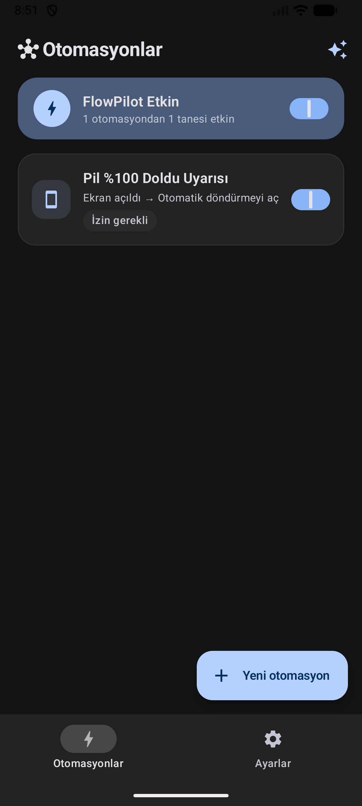
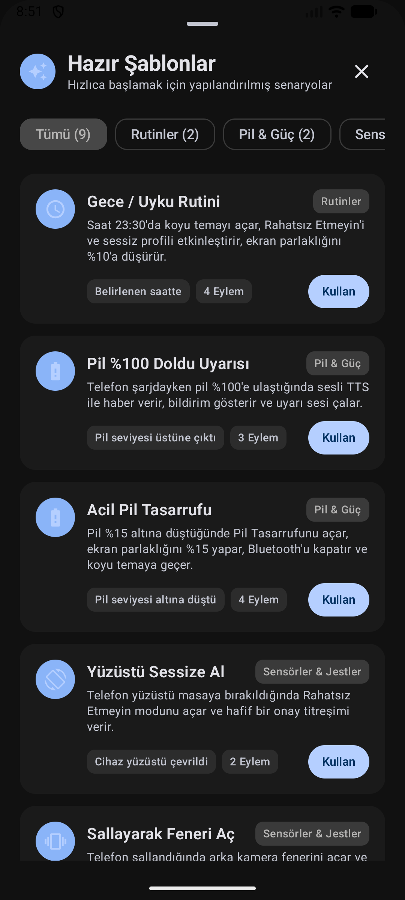
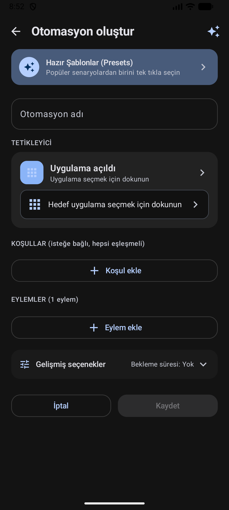
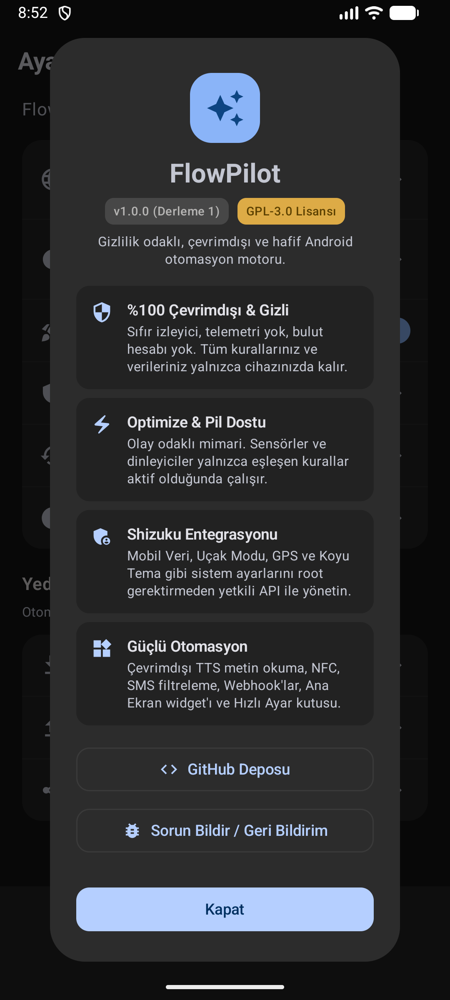

<div align="center">

# ⚡ FlowPilot

**Gizlilik odaklı, çevrimdışı ve hafif Android otomasyon motoru.**

[](LICENSE)
[-brightgreen.svg)](https://developer.android.com)
[](https://kotlinlang.org)
[](https://developer.android.com/jetpack/compose)
[](https://shizuku.rikka.app)
[](https://mi.com)
[](#kaynak-koddan-derleme)

<br/>

[🇹🇷 Türkçe](README.tr.md) &nbsp;•&nbsp; [🇺🇸 English](README.md)

</div>

---

> [!NOTE]
> **📱 Cihaz Uyumluluğu & Topluluk Testi Bilgilendirmesi:**  
> FlowPilot bağımsız bir geliştirici tarafından geliştirilmekte olup, geliştiricinin şahsi cihazı olduğu için şu an **öncelikli olarak Xiaomi HyperOS (Xiaomi 15T Pro)** üzerinde geliştirilmiş ve bizzat test edilmiştir. Proje genelinde standart Android API'lerine ve en iyi pratiklere sadık kalınmıştır; ancak diğer üretici arayüzlerinde (Google Pixel, Samsung One UI, OxygenOS, Motorola vb.) henüz test imkanı olmamıştır. Farklı cihazlardaki test raporlarınız, hata bildirimleriniz ve geliştirmeleriniz (Pull Request) memnuniyetle karşılanır!

## 🌟 Neden FlowPilot?

Android ekosistemindeki popüler otomasyon araçlarının büyük kısmı zorunlu bulut hesapları, agresif telemetri/izleyiciler, pili tüketen sürekli yoklama (polling) servisleri ve karmaşık arayüzlerle doludur.

**FlowPilot** bu durumu kökten değiştirir:

- 🔒 **Varsayılan Olarak Gizli:** Telemetri veya bulut eşitlemesi yoktur. Yapılandırılmış Webhook, SMS ve dışa aktarma işlemleri yalnızca seçtiğiniz verileri gönderebilir.
- ⚡ **Pil Dostu & Olay Odaklı:** İşlemciyi sürekli uyanık tutan gereksiz döngüler yoktur. Sensörler (ivmeölçer, yakınlık, ortam ışığı) ve yayın alıcıları yalnızca aktif bir kural ihtiyaç duyduğunda dinamik olarak devreye girer.
- 🛡️ **Shizuku Entegrasyonu:** Mobil Veri, Uçak Modu, GPS ve Koyu Tema gibi sistem düzeyindeki ayarları root erişimine gerek kalmadan güvenli ADB yetkileriyle kontrol edin.
- 🎨 **Modern Material 3 Tasarımı:** Dinamik Aydınlık ve Koyu tema, akıcı animasyonlar ve yüksek erişilebilirlik standartlarına sahip saf Jetpack Compose mimarisi.
- 🔊 **Çevrimdışı Metin Okuma (TTS):** İnternet bağlantısı gerektirmeyen, cihaz üzerinde önbelleklenen yüksek kaliteli sesli duyuru altyapısı.
- 🔄 **Açık Ekosistem:** Otomasyon kurallarını JSON formatında dışa aktarın, paylaşın veya Birleştirme / Üzerine Yazma seçenekleriyle içe aktarın.

---

## 📸 Uygulama İçi Ekran Görüntüleri

<div align="center">
  <table>
    <tr>
      <td align="center" width="25%"><b>Ana Ekran</b></td>
      <td align="center" width="25%"><b>Hazır Şablonlar</b></td>
      <td align="center" width="25%"><b>Kural Oluşturma</b></td>
      <td align="center" width="25%"><b>Ayarlar &amp; Hakkında</b></td>
    </tr>
    <tr>
      <td></td>
      <td></td>
      <td></td>
      <td></td>
    </tr>
  </table>
</div>

---

## 🚀 Öne Çıkan Özellikler

### 1. Tetikleyiciler (Olaylar)
FlowPilot, donanım, sistem ve kullanıcı kaynaklı geniş bir olay yelpazesini dinler:
- **Uygulama:** Seçili uygulamanın açılması veya kapanması (`UsageStatsManager` olay geçişleri).
- **Güç & Pil:** Şarj cihazına takılma / çıkarılma, pil yüzdesinin belirlenen eşiğin altına düşmesi veya üstüne çıkması.
- **Ekran & Kilit:** Ekranın açılması / kapanması, kilit ekranının açılması.
- **Zaman & Takvim:** Günlük, hafta içi, hafta sonu veya seçili gün/saatlerde zamanlanmış tetikleme.
- **Bağlantı & Radyo:** Belirli bir Wi-Fi ağına bağlanma veya ayrılma (SSID bazlı), eşleşmiş Bluetooth cihazına bağlanma veya ayrılma.
- **Sensörler & Hareket:**
  - **Cihazı Çevirme (Flip):** Telefonun yüzüstü masaya konması veya tekrar kaldırılması (Yakınlık sensörü + Yerçekimi/İvmeölçer Z-ekseni ve 500ms kararlılık filtreleme doğrulaması).
  - **Sallama (Shake):** Hassasiyet ayarlı telefon sallama algılaması.
  - **Ortam Işığı:** Gerçek zamanlı ışık sensörü ölçümüyle belirlenen lüks (lx) değerinin altına düşmesi veya üstüne çıkması.
- **Donanım & Etiketler:** NFC etiketi okutulması (hex UID eşleme).
- **İletişim:**
  - **Aramalar:** Gelen arama çalıyor, arama yanıtlandı, giden arama başlatıldı ve arama bitti durumları.
  - **SMS Mesajları:** Gönderen numaraya ve mesaj içeriğine göre filtreleme (kelime içeriyor, tam eşleşme, ile başlıyor veya Regex).
- **Bildirimler:** Seçili uygulamalardan gelen bildirimler ve isteğe bağlı anahtar kelime filtreleme.

---

### 2. Koşullar (Mantıksal Filtreler)
Kurallar yalnızca tüm koşullar aynı anda sağlandığında (VE mantığı) çalıştırılır:
- **Zaman Aralığı (`TIME_BETWEEN`):** Örn: Yalnızca 23:00 - 07:00 saatleri arasında çalış (gece yarısını geçen zaman aralıkları tam desteklenir).
- **Haftanın Günleri (`DAYS_OF_WEEK`):** Hafta içi, hafta sonu veya özel seçili günler.
- **Pil Seviyesi:** Pil seviyesinin belirlenen yüzdenin altında veya üstünde olması koşulu.
- **Şarj Durumu:** Yalnızca şarja takılıyken veya pilde çalışırken.
- **Ekran Durumu:** Yalnızca ekran açıkken veya kilitliyken.
- **Wi-Fi Durumu:** Yalnızca belirli bir Wi-Fi ağına bağlıyken.

---

### 3. Eylemler (İşlemler)
Tek bir kural içerisinde birden fazla eylemi sıralayabilir, sürükleyip bırakarak sırasını değiştirebilir ve her eylem öncesine 0–300 saniye gecikme ekleyebilirsiniz:
- **Bağlantı (Shizuku ile):** Wi-Fi, Mobil Veri, Uçak Modu, Bluetooth ve Konum (GPS) açma/kapatma.
- **Ekran & Araçlar:** El feneri açma/kapatma, Koyu Tema (Shizuku), Ekranı Otomatik Döndürme, Ekran Parlaklığı ayarlama, Ekranı Kilitleme (Shizuku), Uygulamayı Zorla Durdurma (Shizuku).
- **Ses & Uyarılar:** Rahatsız Etmeyin (DND) açma/kapatma, Ses Profilleri (Normal / Titreşim / Sessiz), Medya Sesini Ayarlama (%0–100), Ses Çalma (1–60 sn süre sınırlı sistem sesi veya özel MP3/WAV), Titreşim (Tek darbe, Çift dokunuş, Uyarı, Kalp atışı, Üçlü dokunuş, SOS), Bildirim Gösterme.
- **Metin Okuma (TTS):** Cihazın çevrimdışı motoruyla yazılan metni konuşarak seslendirme (konuşma hızı ayarı ve çevrimdışı ses filtreleme).
- **Saat & Sayaç:** Sistem alarmı kurma, arka planda sessiz sayaç/zamanlayıcı başlatma (1 sn – 24 saat).
- **Uygulama & Web:** Cihazdaki bir uygulamayı açma, web bağlantısı (URL) açma.
- **Telefon & SMS:** Arama ekranını açma, numara çevirme, doğrudan telefon araması başlatma, doğrudan arka planda SMS gönderme, SMS taslağı hazırlama.
- **HTTPS Webhook:** Dinamik şablon değişkenleriyle (`${trigger}`, `${batteryPercent}`, `${isCharging}`, `${wifiSsid}`, `${time}`, `${timestamp}`, `${location.lat}`, `${location.lng}`, `${location.maps_url}`) dış sunuculara HTTPS isteği gönderme (`GET`, `POST`, `PUT`, `PATCH`, `DELETE`, `HEAD`). Hassas başlık ve anahtarlar AES-256-GCM Keystore ile cihazda şifrelenir.

---

### 4. Hazır Şablonlar (Reçeteler)
Tek tıkla kullanıma hazır popüler senaryolar:
- 🌙 **Gece Rutini:** 23:30'da Koyu Temayı açar, sessiz profile geçer, Rahatsız Etmeyin modunu açar ve parlaklığı %10'a düşürür.
- 🔋 **Tam Pil Koruması (%100):** Şarj tamamlandığında çevrimdışı sesli uyarı verir ve bildirim gösterir.
- ⚡ **Acil Pil Tasarrufu:** Pil %15'in altına indiğinde Pil Tasarrufunu açar, Bluetooth'u kapatır, parlaklığı %15 yapar ve koyu temaya geçer.
- 🔕 **Ters Çevir ve Sustur:** Telefon masaya yüzüstü konulduğunda hafif bir titreşimle Rahatsız Etmeyin moduna geçer.
- 🔦 **Sallayarak Fener Aç:** Telefon sağlam şekilde sallandığında kamera fenerini açar veya kapatır.
- 🎬 **Sinema / Gece Okuma Modu:** Ortam ışığı 5 lüksün altına indiğinde parlaklığı %5 yapar ve koyu temayı açar.
- 🚗 **Evden Çıkış Modu:** Ev Wi-Fi bağlantısı koptuğunda mobil veriyi açar, zil sesini normale alır ve sesi %80 yapar.
- 🏠 **Eve Giriş Modu:** Ev Wi-Fi ağına bağlanıldığında tasarruf için mobil veriyi kapatır ve dengeli ayarlara döner.
- 📍 **SMS Acil Konum Yanıtlayıcı:** Belirlenen gizli kelimeyle SMS geldiğinde GPS uydularına kilitlenir ve canlı Google Haritalar konumunu SMS ile otomatik yanıtlar.

---

### 5. Hızlı Kontroller & Widget
- **Hızlı Ayarlar Kutusu (Quick Settings Tile):** Bildirim panelinden tek tıkla otomasyon motorunu açıp kapatabilme veya durum izleme.
- **Ana Ekran Widget'ı (Jetpack Glance):** Aktif kural sayısını gösteren ve tek dokunuşla motoru duraklatıp devam ettiren şık Material 3 widget'ı.
- **Canlı Eylem Testi:** Bir kuralı kaydetmeden önce, üzerindeki tüm düzenlemeleri doğrudan cihazda anında test edebilme.
- **Çalışma Geçmişi:** Son 100 kural tetiklenmesini ve eylem sonuçlarını gizlilik ilkeleriyle kaydeden yerel denetim günlüğü.

---

## 🛠️ Mimari ve Kullanılan Teknolojiler

```
FlowPilot
├── app/src/main/java/com/flowpilot/app/
│   ├── actions/          # Eylem yürütücüleri (Shizuku, TTS, Webhook, Ses, Sistem, Telefon)
│   ├── data/             # Veri modelleri, JSON serileştirme, DataStore deposu, Yedekleme
│   ├── engine/           # Ön plan AutomationService, BroadcastReceiver'lar, Sensör takipçileri
│   ├── glance/           # Jetpack Glance Ana Ekran Widget uygulaması
│   ├── quicksettings/    # Hızlı Ayarlar Servisi (TileService)
│   ├── shizuku/          # Shizuku AIDL IPC köprüsü
│   └── ui/               # Jetpack Compose arayüzü (Tema, Ekranlar, Bileşenler, Seçiciler)
└── app/src/test/         # Deterministik JUnit birim testleri
```

- **Dil:** Kotlin 2.2.10
- **Arayüz:** Jetpack Compose & Material 3
- **Eşzamanlılık:** Kotlin Coroutines & StateFlow
- **Kalıcılık:** Android Jetpack DataStore (Preferences & JSON)
- **Güvenlik:** Android Keystore (AES-256-GCM şifreleme)
- **Sistem Erişimi:** Shizuku AIDL IPC Köprüsü
- **Widget:** Android Jetpack Glance
- **Uyumluluk:** Minimum Android 8.0 (API 26) — Hedef Android 16 (API 36)

---

## 📥 Kaynak Koddan Derleme

### Gereksinimler
- JDK 17 (Eclipse Temurin veya OpenJDK)
- Android SDK (Platform 36 ve Build-Tools 36.0.0+)
- Git

### Derleme Adımları
```bash
# Depoyu klonlayın
git clone https://github.com/emi-ran/flowpilot.git
cd flowpilot

# Birim testlerini çalıştırın
./gradlew testDebugUnitTest

# Hata ayıklama (Debug) APK'sını oluşturun
./gradlew assembleDebug
```

Derlenen APK şu yolda yer alır:
```text
app/build/outputs/apk/debug/app-debug.apk
```

### Cihaza ADB ile Yükleme
```bash
adb install -r app/build/outputs/apk/debug/app-debug.apk
```

---

## 🛡️ Shizuku Kurulum Kılavuzu

Mobil Veri, Uçak Modu, GPS ve Koyu Tema kontrolü gibi yetkili eylemler root erişimi olmadan **Shizuku** üzerinden yürütülür:

1. [Shizuku](https://shizuku.rikka.app/) uygulamasını Google Play veya GitHub üzerinden yükleyin.
2. Shizuku'yu **Kablosuz Hata Ayıklama** (Android 11+) veya bilgisayardan ADB komutuyla başlatın:
   ```bash
   adb shell sh /sdcard/Android/data/moe.shizuku.privileged.api/start.sh
   ```
3. **FlowPilot** uygulamasını açın -> İstendiğinde FlowPilot'a Shizuku iznini onaylayın.
4. Tüm yetkili eylemler artık **Kullanılabilir** duruma gelecek ve sorunsuz çalışacaktır.

---

## 🔒 Gizlilik Politikası

FlowPilot **sıfır-güven (zero-trust)** gizlilik prensibiyle geliştirilmiştir:
- **Telemetri veya Bulut Eşitlemesi Yoktur:** Uygulama içinde çökme raporlayıcıları, analitik kodları, reklam kütüphaneleri veya bulut eşitlemesi bulunmaz.
- **Yapılandırılmış Veri Paylaşımı:** Kullanıcı tarafından yapılandırılan Webhook, SMS eylemleri ve dışa aktarma işlemleri yalnızca seçtiğiniz verileri gönderebilir.
- **Konum Verisi:** Yalnızca yerel olarak bağlı olunan Wi-Fi adını tespit etmek ve kullanıcının özel olarak kurguladığı SMS/Webhook şablonlarına koordinat sağlamak için kullanılır.
- **Telefon & SMS:** Yalnızca kuralları tetiklemek için kullanılır; numara ve içerikler geçmişte veya loglarda asla ham halde tutulmaz.

### Dağıtım ve kısıtlı izinler

FlowPilot, kullanıcıya gösterilen Uygulama Seçici içinde `PackageManager.getInstalledApplications()` çağırıp başlatılabilir paketleri filtrelediği için `QUERY_ALL_PACKAGES` bildirir. Bu izin kaldırılırsa, paket görünürlüğünün sınırlandığı Android sürümlerinde temel uygulama seçici bozulur. `RECEIVE_SMS`, gelen SMS tetikleyicileri için `SmsReceiver` tarafından; `SEND_SMS`, kullanıcının yapılandırdığı doğrudan SMS eylemleri için `SmsExecutor` tarafından kullanılır. `ACCESS_BACKGROUND_LOCATION`, etkin kurallar etkinlik görünür değilken koordinat istediğinde `LocationFetcher` tarafından; `FOREGROUND_SERVICE_LOCATION` ise konum ön plan hizmeti alt türünü yetkilendirmek için kullanılır. Kural istemediğinde konum sürekli toplanmaz.

Bu izinler Google Play'de kısıtlı veya politika açısından hassastır. Bu depo Play uyumluluğu ya da onay garantisi iddia etmez. Kısıtlı izinleri kaldıran Play'e özel bir flavor yoktur; kaldırmak temel özellikleri devre dışı bırakır. Play sürümü için güncel politika incelemesi, gerekli beyanlar, doğru Veri güvenliği açıklamaları ve Google onayı gerekir. Bunlar tamamlanana kadar derlemeleri GitHub sürümleri, F-Droid veya sideloading üzerinden dağıtın. Yalnızca güvendiğiniz kaynaklardan yükleyin.

---

## 🤝 Katkıda Bulunma

Hata bildirimleri, öneriler ve kod katkıları memnuniyetle karşılanır!
- Lütfen katkı öncesinde [CONTRIBUTING.md](CONTRIBUTING.md) dosyasını inceleyin.
- Bir sorunla karşılaştıysanız [Hata Bildirimi](https://github.com/emi-ran/flowpilot/issues/new?template=bug_report.md) oluşturabilirsiniz.
- Yeni bir tetikleyici veya eylem öneriniz varsa [Özellik İsteği](https://github.com/emi-ran/flowpilot/issues/new?template=feature_request.md) şablonunu kullanabilirsiniz.

---

## 📄 Lisans

FlowPilot, **GNU General Public License v3.0 (GPL-3.0)** kapsamında lisanslanmış özgür ve açık kaynaklı bir yazılımdır.  
Ayrıntılar için [LICENSE](LICENSE) dosyasına göz atabilirsiniz.

---

<div align="center">
Android Güç Kullanıcıları için ❤️ ile Geliştirildi
</div>
