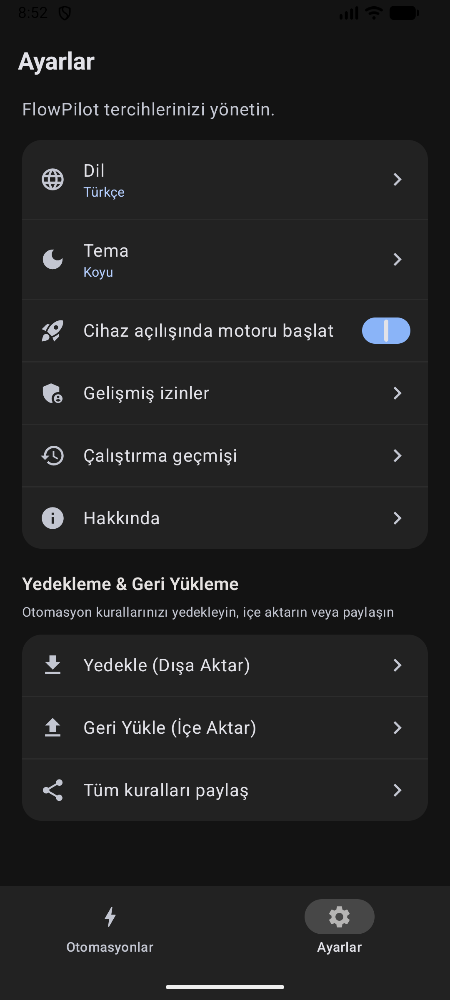

<div align="center">

# ⚡ FlowPilot

### Gizlilik odaklı, pil dostu ve hafif Android otomasyon motoru — rootsuz.

Olay odaklı tetikleyiciler, Shizuku ile ayrıcalıklı sistem yetkileri ve akıcı Material 3 arayüzüyle cihazınızı zahmetsizce otomatikleştirin. Telemetri yok, bulut hesabı zorunluluğu yok ve arka planda gereksiz pil tüketimi yok.

<br/>

[](https://github.com/emi-ran/flowpilot/releases)
[-34A853?logo=android&logoColor=white)](https://developer.android.com)
[](https://kotlinlang.org)
[](https://developer.android.com/jetpack/compose)
[](https://shizuku.rikka.app)
[](#-gizlilik-ve-s%C4%B1f%C4%B1r-g%C3%BCven-ilkesi)
[](LICENSE)

<br/>

[**🇹🇷 Türkçe**](README.tr.md) &nbsp;•&nbsp; [**🇺🇸 English**](README.md)

<br/>

<p align="center">
  <a href="https://github.com/emi-ran/flowpilot/releases/latest">
    
  </a>
  &nbsp;
  <a href="#-nasıl-çalışır">
    
  </a>
  &nbsp;
  <a href="#-1-tıkla-hazır-reçeteler">
    
  </a>
  &nbsp;
  <a href="#-shizuku-kurulum-kılavuzu">
    
  </a>
</p>

</div>

---

> [!NOTE]
> **📱 Cihaz Uyumluluğu & Topluluk Testi Bilgilendirmesi**
> FlowPilot bağımsız bir açık kaynak projesidir ve bizzat geliştiricinin kişisel cihazı olan **Xiaomi HyperOS (Xiaomi 15T Pro)** üzerinde günlük olarak geliştirilip test edilmektedir. Proje genelinde standart Android Jetpack ve sistem API'lerine titizlikle uyulmuş, CI doğrulamasında ise **API 35 Android Emulator** ile çalışma zamanı sözleşmeleri denetlenmektedir.
>
> Farklı üretici arayüzleri (Samsung One UI, Google Pixel, Motorola, OxygenOS vb.) arka plan kısıtlamalarını farklı uygulayabildiğinden, test geri bildirimleriniz, cihaz deneyimleriniz ve katkılarınız (Pull Request) memnuniyetle karşılanır!

---

## 🌟 Neden FlowPilot?

Geleneksel Android otomasyon uygulamaları genelde karmaşık arayüzler, sürekli arka plan döngüleriyle pili bitiren servisler veya zorunlu bulut üyelikleriyle gelir. **FlowPilot bu anlayışı değiştirmek için geliştirildi.**

<table>
  <tr>
    <td width="50%">
      <h3>🔋 Pil Dostu &amp; Olay Odaklı</h3>
      <p>İşlemciyi uyanık tutan (wake-lock) gereksiz döngüler yoktur. Donanım sensörleri (ivmeölçer, yakınlık, ışık) ve yayın alıcıları <b>yalnızca aktif bir kural ihtiyaç duyduğunda</b> devreye girer, işi bitince anında kapanır.</p>
    </td>
    <td width="50%">
      <h3>🔒 %100 Çevrimdışı &amp; Gizli</h3>
      <p>Analitik, telemetri, uzaktaki sunucular veya hesap kayıtları yoktur. Her şey yalnızca cihazınızda gerçekleşir. Yapılandırılmış Webhook ve SMS eylemleri sadece sizin seçtiğiniz verileri iletir.</p>
    </td>
  </tr>
  <tr>
    <td width="50%">
      <h3>🛡️ Root Gerektirmeyen Süper Güçler</h3>
      <p><b>Shizuku</b> desteği sayesinde Mobil Veri, Uçak Modu, GPS, Koyu Tema ve Uygulama Durdurma gibi yetkili işlemleri cihazınızı rootlamadan, güvenli ADB izinleriyle yönetin.</p>
    </td>
    <td width="50%">
      <h3>🎨 Modern Material 3 &amp; Compose</h3>
      <p>Tamamen yerel <b>Jetpack Compose</b> ile inşa edilmiştir. Akıcı animasyonlar, dinamik Material You renk temaları, dokunsal titreşim geri bildirimleri ve şık Glance ana ekran widget'ı sunar.</p>
    </td>
  </tr>
  <tr>
    <td width="50%">
      <h3>🔊 Çevrimdışı Metin Okuma (TTS)</h3>
      <p>Cihaz içi ses sentezleme motoru sayesinde internete ihtiyaç duymadan telefonunuzun sizinle konuşmasını sağlayın. Şarj uyarısı veya gece rutini için özel sesli anonslar oluşturun.</p>
    </td>
    <td width="50%">
      <h3>🔐 Güvenli Paylaşım &amp; Şifreli Yedek</h3>
      <p>Kurallarınızı temizlenmiş JSON olarak paylaşın veya tüm otomasyon arşivinizi <b>AES-256-GCM parola korumalı</b> (100.000 iterasyon PBKDF2) güvenli yedeklerle koruma altına alın.</p>
    </td>
  </tr>
</table>

---

## 📸 Ekran Görüntüleri

<div align="center">
  <table>
    <tr>
      <td align="center" width="20%"><b>Ana Ekran</b></td>
      <td align="center" width="20%"><b>Hazır Şablonlar</b></td>
      <td align="center" width="20%"><b>Kural Oluşturucu</b></td>
      <td align="center" width="20%"><b>Ayarlar &amp; Yedek</b></td>
      <td align="center" width="20%"><b>Hakkında</b></td>
    </tr>
    <tr>
      <td></td>
      <td></td>
      <td></td>
      <td></td>
      <td></td>
    </tr>
  </table>
</div>

---

## 💡 Nasıl Çalışır?

FlowPilot son derece sezgisel, 3 adımlı bir zihinsel model izler:

```
┌───────────────────────────┐      ┌───────────────────────────┐      ┌───────────────────────────┐
│      1. TETİKLEYİCİ       │      │        2. KOŞULLAR        │      │        3. EYLEMLER        │
│      "Şu olduğunda"       │ ───► │   "Yalnızca hepsi uyuyorsa"│ ───► │     "Sırayla şunları yap" │
│   (Örn: İşe vardığımda)   │      │    (Örn: Yalnızca Hafta İçi)│     │(Sessize al + Wi-Fi'ı aç)  │
└───────────────────────────┘      └───────────────────────────┘      └───────────────────────────┘
```

### Günlük Hayattan Senaryolar:
- 🌙 **Gece Rutini:** Saat 23:30 olduğunda ➔ *Eğer cihaz şarjdaysa* ➔ Sessiz profile geç, Rahatsız Etmeyin'i aç ve parlaklığı %10'a düşür.
- 🔋 **Tam Şarj Uyarısı:** Pil %100 dolduğunda ➔ *Çevrimdışı sesle* "Pil tamamen doldu, lütfen şarjdan çıkarın" anonsu yap ve bildirim göster.
- 🔕 **Ters Çevir ve Sustur:** Telefon masaya yüzüstü konulduğunda ➔ *Hafif bir titreşim onayıyla* Rahatsız Etmeyin modunu aktif et.

---

## ⚡ 1 Tıkla Hazır Reçeteler

Günlük yaşamınızı anında kolaylaştıracak yerleşik şablonlarla hemen başlayın:

| Reçete | Tetikleyici | Başlıca Eylemler |
| :--- | :--- | :--- |
| 🌙 **Gece Rutini** | Saat 23:30 olduğunda | Koyu Temayı açar, Sessiz profile geçer, DND modunu açar, parlaklığı %10 yapar |
| 🔋 **Tam Pil Koruması** | Pil %100'e ulaştığında | Çevrimdışı sesli şarjdan çıkarma uyarısı seslendirir ve bildirim gönderir |
| ⚡ **Acil Pil Tasarrufu** | Pil %15 altına düştüğünde | Pil Tasarrufunu açar, Bluetooth'u kapatır, parlaklığı %15 yapar, Koyu Temaya geçer |
| 🔕 **Ters Çevir ve Sustur** | Telefon yüzüstü konulduğunda | Çift sensör doğrulamasıyla (Yakınlık + Yerçekimi Z-ekseni) DND modunu titreşimle açar |
| 🔦 **Sallayarak Fener Aç** | Cihaz sağlam sallandığında | Kamera flaşını dokunsal geri bildirimle açar veya kapatır |
| 🎬 **Sinema / Gece Okuma** | Ortam ışığı < 5 lüks olduğunda | Parlaklığı minimuma indirir ve sistemi Koyu Temaya geçirir |
| 🚗 **Evden Çıkış Modu** | Ev Wi-Fi bağlantısı koptuğunda | Mobil Veriyi açar (Shizuku), Normal zil sesine geçer, medya sesini %80 yapar |
| 🏠 **Eve Giriş Modu** | Ev Wi-Fi ağına bağlanıldığında | Pil tasarrufu için Mobil Veriyi kapatır (Shizuku) ve dengeli ses ayarlarını geri yükler |
| 📍 **SMS Acil Konum Yanıtlayıcı**| Gizli kelimeli SMS geldiğinde | GPS koordinatlarını alıp harita bağlantısını SMS ile otomatik yanıtlar |

---

## 🎛️ Kabiliyetler Matrisi

### 1. Tetikleyiciler (Olaylar)
FlowPilot zengin bir donanım, radyo ve sistem olayı yelpazesini dinler:

- 📱 **Uygulama Döngüsü:** Seçilen uygulamanın açılması veya kapanması (düşük maliyetli `UsageStatsManager` geçişleri).
- 🔌 **Güç & Pil:** Şarja takılma / çıkarılma, pil seviyesinin belirlenen yüzdenin üstüne çıkması veya altına inmesi.
- 💡 **Ekran & Durum:** Ekranın açılması / kapanması, kilit ekranının açılması.
- ⏰ **Zaman & Takvim:** Günlük, hafta içi, hafta sonu veya özel seçili gün ve saatlerde zamanlanmış tetikleme.
- 📶 **Bağlantılar:** Wi-Fi ağına bağlanma / ayrılma (tüm ağlar veya belirli SSID), Bluetooth cihazına bağlanma / ayrılma.
- 🔄 **Sensörler & Hareket:**
  - **Cihazı Çevirme:** Yüzüstü masaya konma veya tekrar çevrilme (Yakınlık + Yerçekimi Z-ekseni, 500ms kararlılık filtresi).
  - **Sallama:** Hassasiyet ayarlı telefon sallama algılaması.
  - **Ortam Işığı:** Lüks değerinin belirlenen sınırın altına düşmesi veya üstüne çıkması.
- 📍 **Donanım Coğrafi Çit (Geofence):** Google Play Services `GeofencingClient` ile belirlenen alana giriş/çıkış. Boşta CPU wake-lock kullanmaz; yeniden başlatmada kaybolmayan 50 olaylık kalıcı kuyruk ve şablon değişkenlerinde doğrudan koordinat kullanımı sağlar.
- 🏷️ **NFC Etiketleri:** Fiziksel taramalarda anında hex UID eşleşmesi. Ön plandaki ReaderMode taramaları eşleşen kuralları otomatik çalıştırır; Android arka plan keşfi FlowPilot'ı açar ve eşleşen NFC otomasyonu çalışmadan önce açık onay ister.
- 📞 **Arama & SMS:** Gelen arama çalıyor, yanıtlandı, giden arama başladı, arama bitti; SMS gönderen numaraya ve kelime, önek veya regex kalıbına göre tetikleme.
- 🔔 **Bildirimler:** Seçili uygulamalardan gelen bildirimler ve anahtar kelime filtreleme.

---

### 2. Koşullar (Mantıksal Filtreler)
Kurallar yalnızca tüm koşullar aynı anda sağlandığında (VE mantığı) çalıştırılır:

- ⏳ **Zaman Aralığı:** Yalnızca belirlenen saatler arasında çalış (örn: 23:00 - 07:00, gece yarısını geçen aralıklar tam desteklenir).
- 📅 **Haftanın Günleri:** Hafta içi, hafta sonu veya özel seçili günler.
- 🔋 **Pil Seviyesi:** Pilin belirli bir yüzdenin $\ge$ veya $\le$ olması.
- ⚡ **Şarj Durumu:** Cihazın şarjda veya pilde olması koşulu.
- 📲 **Ekran Durumu:** Ekranın açık veya kilitli olması koşulu.
- 📶 **Wi-Fi Ağı:** Yalnızca belirli bir Wi-Fi ağına (SSID) bağlıyken çalış.

---

### 3. Eylemler (İşlemler)
Tek bir kuralda birden çok eylemi sürükle-bırak yöntemiyle dilediğiniz sırada çalıştırın ve eylemler arasına gecikme (0–300 sn) ekleyin:

- 🌐 **Bağlantı Kontrolü (Shizuku ile):** Wi-Fi, Mobil Veri, Uçak Modu, Bluetooth ve GPS Konum açma/kapatma.
- 🖥️ **Ekran & Sistem:** El Feneri açma/kapatma, Koyu Tema (Shizuku), Ekranı Otomatik Döndürme, Parlaklık seviyesi, Ekranı Kilitleme (Shizuku), Uygulamayı Zorla Durdurma (Shizuku).
- 🔊 **Ses & Uyarılar:** Rahatsız Etmeyin (DND) açma/kapatma, Ses Profilleri (Normal / Titreşim / Sessiz), Medya Sesi (%0–100), Özel Ses Çalma (1–60 sn), Titreşim Şablonları (Tek darbe, Çift dokunuş, Uyarı, Kalp atışı, Üçlü dokunuş, SOS) ve Bildirim Gösterme.
- 🗣️ **Çevrimdışı Seslendirme (TTS):** Cihazın yerleşik TTS motoruyla metinleri sesli olarak okuma (konuşma hızı ayarlı).
- ⏱️ **Saat & Sayaç:** Sistem alarmı kurma veya arka planda sessiz zamanlayıcı başlatma (1 sn – 24 saat).
- 🚀 **Uygulama & Web:** Cihazdaki bir uygulamayı açma veya web bağlantısına yönlendirme.
- 💬 **Telefon & SMS:** Arama ekranını açma, doğrudan telefon araması başlatma, doğrudan arka planda SMS gönderme veya SMS taslağı hazırlama.
- 🔗 **HTTPS Webhook:** Canlı şablon değişkenleriyle dış sunuculara güvenli HTTP istekleri (`GET`, `POST`, `PUT`, `PATCH`, `DELETE`, `HEAD`) gönderme; başlıklar ve anahtarlar AES-256-GCM Keystore ile cihazda şifrelenir:
  - `${trigger}`, `${batteryPercent}`, `${isCharging}`, `${wifiSsid}`, `${time}`, `${timestamp}`, `${location.lat}`, `${location.lng}`, `${location.coords}`, `${location.maps_url}`

---

### 4. Akıllı Verimlilik & Kolaylıklar
- **Hızlı Ayarlar Kutusu ve Motor Bildirimi:** Otomasyon motorunu bildirim çubuğundan tek dokunuşla açıp kapatabilme veya canlı durumunu görme. Motor durumu ve başlatma hatası bildirimleri, arka plan yeniden başlatmalarından sonra da FlowPilot'ın İngilizce, Türkçe veya sistem dili ayarını izler.
- **Material 3 Ana Ekran Widget'ı:** Aktif kural sayısını gösteren ve tek dokunuşla motoru duraklatıp sürdüren Glance widget'ı.
- **Canlı Eylem Testi:** Bir kuralı kaydetmeden önce oluşturduğunuz eylemleri doğrudan cihazınızda test edebilme.
- **Güvenli Kural Çoğaltma:** Mevcut bir kuralı tek tıkla çoğaltma; webhook şifreleri hedef kopya için Keystore ile yeniden şifrelenir.
- **Çalışma Geçmişi:** Son 100 kural tetiklenmesini, eylem bazında sonuçları ve maskelenmiş güvenli detaylarıyla yerel günlükte saklama. Ham sağlayıcı hataları, özel URI'ler, yerel dosya yolları, kimlik bilgileri ve telefon numaraları kalıcı olarak saklanmaz.
- **Çakışma Uyarıları:** Birbirine zıt durum eylemleri içeren kurallarda otomatik, engelleyici olmayan akıllı uyarı sistemi.

---

## 🛡️ Shizuku Kurulum Kılavuzu

FlowPilot, yetkili işlemleri (Mobil Veri, Uçak Modu, GPS, Koyu Tema, Uygulama Kapatma) root gerektirmeden güvenle yürütebilmek için **Shizuku** köprüsünü kullanır.

1. **Shizuku'yu Yükleyin:** [Google Play](https://play.google.com/store/apps/details?id=moe.shizuku.privileged.api) veya [GitHub](https://shizuku.rikka.app/) üzerinden indirin.
2. **Shizuku Servisini Başlatın:**
   - **Android 11 ve üzeri (Kablosuz Hata Ayıklama):** Bilgisayara gerek kalmadan Geliştirici Seçenekleri > Kablosuz Hata Ayıklama üzerinden doğrudan telefonda başlatın.
   - **Bilgisayardan (ADB ile):** Şu komutu çalıştırın:
     ```bash
     adb shell sh /sdcard/Android/data/moe.shizuku.privileged.api/start.sh
     ```
3. **FlowPilot'a İzin Verin:** FlowPilot'ı açın ve ekranda beliren Shizuku yetkilendirmesini onaylayın.
4. Tüm yetkili işlemler hemen aktif hale gelecek ve sorunsuz çalışacaktır!

---

## 🔒 Gizlilik ve Sıfır-Güven İlkesi

FlowPilot kullanıcı gizliliğine tavizsiz bir bağlılıkla tasarlanmıştır:

- 🚫 **Sıfır Telemetri:** Firebase Analytics, Sentry, uzaktan çökme raporlayıcıları veya takip SDK'ları yer almaz.
- 📵 **Bulut Eşitlemesi Yok:** Kurallarınız, günlükleriniz ve anahtarlarınız asla üçüncü taraf bir buluta gönderilmez.
- 🛡️ **Android Keystore Koruması:** Webhook şifreleri ve özel başlıklar AES-256-GCM ile Android Keystore içinde, cihaz desteklediğinde donanım destekli olarak korunur.
- 🙈 **Kişisel Veri Maskeleme:** Telefon numaraları, webhook anahtarları ve gizli başlıklar arayüzde ve loglarda maskelenmiş olarak tutulur.

### Şeffaf İzin Açıklamaları
FlowPilot hassas izinleri yalnızca açık otomasyon özelliklerini yerine getirebilmek için talep eder:
- `QUERY_ALL_PACKAGES`: Android 11+ sürümlerinde Uygulama Tetikleyici ve Uygulama Açıcı listelerini gösterebilmek için gereklidir.
- `RECEIVE_SMS` & `SEND_SMS`: Yalnızca SMS tetikleyicisi ve doğrudan SMS gönderme eylemlerinde kullanılır.
- `ACCESS_BACKGROUND_LOCATION`: Sıfır pil tüketimli donanım geofence takibi (`GeofencingClient`) ve kullanıcının kurguladığı konum şablonları için kullanılır.
- `FOREGROUND_SERVICE_LOCATION`: Android 14+ sürümlerinde geofence ve aktif konum görevlerinin arka planda sorunsuz sürmesi için gereklidir.

*Not: FlowPilot, bu temel otomasyon izinlerinden feragat etmemek adına Google Play Store dağıtımı hedeflemez. Doğrulanmış APK'ları doğrudan GitHub Releases üzerinden edinebilirsiniz.*

---

## 📦 Yedekleme ve Kurtarma

| Mod | Biçim | Güvenlik | Ne Zaman Kullanılır? |
| :--- | :--- | :--- | :--- |
| **Temizlenmiş JSON** | Düz Metin JSON | Webhook URL ve hassas kimlik bilgileri çıkarılır | Kuralları arkadaşlarınızla veya toplulukla güvenle paylaşırken |
| **Şifreli Tam Yedek** | Şifreli Paket | **AES-256-GCM + PBKDF2** (100.000 iterasyon, salt + IV) | Tüm webhook sırları, telefon numaraları ve aktiflik durumlarıyla eksiksiz yedek |

Geri yükleme çok kolaydır: Dosyanızı seçin, parolanızı girin ve **Birleştir** veya **Üzerine Yaz** tercihinizi yapın. İçe aktarılan sırlar hedef cihazın yerel Android Keystore'u ile anında yeniden şifrelenir.

---

## 🛠️ Mimari ve Teknolojiler

FlowPilot modern Android mimari prensiplerine sadık kalır:

```
FlowPilot
├── app/src/main/java/com/flowpilot/app/
│   ├── actions/          # Eylem yürütücüleri: Shizuku, Ses, TTS, Webhook, SMS, Sistem
│   ├── analysis/         # Çakışma analizi (AutomationConflictAnalyzer) ve kontroller
│   ├── data/             # Veri modelleri, JSON serileştirme, DataStore depoları, Yedekleme
│   ├── engine/           # Ön plan AutomationService, Alıcılar, Sensör takipçileri
│   ├── glance/           # Jetpack Glance Ana Ekran Widget'ı
│   ├── quicksettings/    # Hızlı Ayarlar Servisi (TileService)
│   ├── shizuku/          # Shizuku AIDL IPC köprüsü
│   └── ui/               # Jetpack Compose Arayüzü (Material 3 Tema, Ekranlar, Bileşenler)
└── app/src/test/         # Deterministik JUnit birim testleri
```

- **Dil:** Kotlin 2.2.10
- **Arayüz:** Jetpack Compose & Material 3
- **Eşzamanlılık:** Kotlin Coroutines & StateFlow
- **Depolama:** Jetpack DataStore (Preferences & JSON)
- **Şifreleme:** Android Keystore (AES-256-GCM)
- **Sistem Köprüsü:** Shizuku AIDL IPC
- **Widget:** Jetpack Glance
- **Hedef SDK:** Android 16 (API 36) &bull; **Minimum SDK:** Android 8.0 (API 26)

---

## 📥 Kaynak Koddan Derleme

### Gereksinimler
- JDK 17 (OpenJDK veya Eclipse Temurin)
- Android SDK (Platform 36, Build-Tools 36.0.0+)
- Git

```bash
# Depoyu klonlayın
git clone https://github.com/emi-ran/flowpilot.git
cd flowpilot

# Birim testlerini çalıştırın
./gradlew testDebugUnitTest

# Hata ayıklama (Debug) APK'sını oluşturun
./gradlew assembleDebug
```

Derlenen APK çıktısı:
```text
app/build/outputs/apk/debug/app-debug.apk
```

Cihazınıza doğrudan ADB ile yükleyin:
```bash
adb install -r app/build/outputs/apk/debug/app-debug.apk
```

---

## 🤝 Katkıda Bulunma

Hata bildirimleri, öneriler ve kod katkıları memnuniyetle karşılanır!
- Başlamadan önce [CONTRIBUTING.md](CONTRIBUTING.md) dosyasını inceleyebilirsiniz.
- Bir sorunla karşılaştıysanız [Hata Bildirimi](https://github.com/emi-ran/flowpilot/issues/new?template=bug_report.md) oluşturabilirsiniz.
- Yeni bir tetikleyici veya eylem öneriniz varsa [Özellik İsteği](https://github.com/emi-ran/flowpilot/issues/new?template=feature_request.md) şablonunu kullanabilirsiniz.

---

## 📄 Lisans

FlowPilot, **[GNU General Public License v3.0 (GPL-3.0)](LICENSE)** kapsamında lisanslanmış özgür ve açık kaynaklı bir yazılımdır.

<div align="center">
  <br/>
  <b>Android Güç Kullanıcıları için ❤️ ile Geliştirildi</b>
</div>
